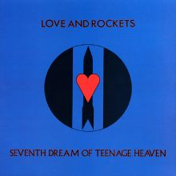

[Some people](https://hicks.design/journal/hicks-design-best-15-albums) will have their go-to list of their favourite albums. As my first post on my blog (I'm not a stranger to maintaining a blog - I had one, back in the early naughties, that I regularly updated) I thought it apt to share what I can be guaranteed to tantalise my ears.

I've purposely kept the list to less-known artists, with the hope that someone might stumble upon this page in the future and discover some new (to them) music from decades gone.

These aren't necessarily in favourite order, chronologically discovered is probably closer.

## L.S.U. - Shaded Pain

 Release in 1987 it contains 10 tracks, this is an album that stands out and causes a lot of polarised opinions. Most Mike Knott fans really don't like it, however I think it's such a gem.

Apart from Mike Knott's vocals, Brian Doidge provides superb guitar and bass. A fine example of this is the track "Plague Of Flies", and yes, this is how you get a guitar to buzz like the beating wings of 1,000 flies.

"Bye Bye Colour" (odd, an American band releasing an America album and spelling 'colour' the "correct" way) is a stand-out track, so is "Lonely Boy" (Bridgett Knott's haunting vocals, shiver!).

## The Choir - Chase The Kangaroo

 Originally released in 1988, it contained 10 tracks. They re-released the album in 2012 where it contains an additional 5 tracks taken off an earlier release ("Shades of Grey", released in 1986), this is usually the version you'll find on streaming services.

The album is dreamy, with touches of shoe-gaze. And there's saxophone, lyricon sprinkled throughout. The production is probably what makes the album sound timeless.

Highlights for me personally have always been "Consider", "Clouds" and "Sad Face".

## Veil of Ashes - Pain

 Released in 1989, it contains 11 tracks. Two of the members from "The Choir" contributed to this album, providing backing vocals on Track 1 and some engineering assistance.

Normally I have to be in a melancholy mood to listen to this album (I guess the title of the album give that away).

The opening track is their cover of Bob Dylan's "The Times They Are A-Changin'". A few songs in you're introduced to "Without Eyes"; which at the time was pointing fingers are the struggles happening in South Africa.

## Adam Again - Homeboys

 Released in 1990, it contains 10 tracks. Again there's contributions to this album by one of the members of "The Choir", it was also recorded at "Neverland", the studio owned by "The Choir".

The album is more blues than guitar-driven rock, there's plenty of Fender Rhodes organ scattered throughout. The album tells of hard-times, love and loss.

If I'm pressed, I'd say the must-listen songs are "Homeboys", "Hide Away" and "No Regrets". However, this album is so good listened to from start to finish.

## Love And Rockets - Seventh Dream Of Teenage Heaven

 Originally released in 1985, it contains 7 tracks. The year after it was released on CD and an additional track was included.

I still listen to this album, on a regular basis. It could have been recorded yesterday, but is the oldest on this list. I love "A Private Future" and "Haunted When The Minutes Drag".

Love And Rockets never really took off in their home country UK, which is a shame. But parts of me is glad - it's a rarity to talk to anyone who knows of them.

An interesting story; in 1994 my brother and I were fortunate enough to spend his 21st birthday money recording 3 tracks at "Far Heath Studio", which has a connection with the band. The following year we bumped into Daniel Ash and David J. while at a Spritualized concert in Leicester - we had met our idols.

## Catherine Wheel - Ferment

 Originally released in 1992, it contained 12 tracks. It's since been re-released and contains 5 additional bonus tracks. The extended version is probably the one you'll find on most streaming services.

What an album. So is their second release "Chrome". I've chosen "Ferment" purely because it contains the epic "Black Metallic". This track was probably my first introduction to a song where it keeps building in intensity and carries on for over 7 minutes. The second track "I Want To Touch You" is another song that makes the hairs on my arms stand on end.

Both my brother and I have fond memories of seeing this band live, in Stoke-on-Trent, in the nineties. One particular gig they did, they had the film "Taxi Driver" playing in the background while they performed. Very memorable.

## Ultra Vivid Scene - Rev

 Also released in 1992, it contains 9 tracks. This wasn't my first introduction to the "band" (I write "band" because the central figure on all releases is Kurt Ralske, he used sessions musicians for most of the recordings).

What makes this album superb? It's full of songs that expand and contract in sound. More than half the tracks exceed 5:30 minutes in length. The penultimate track "Blood And Thunder" is a sprawling 10:22 musical journey and definitely should be listened to.

## This Morn' Omina - 7 Years Of Famine

 Released in 2002, it contains 7 tracks, the shortest being 5:30 minutes, the longest 12:46. This is from my DJing days playing lots of Industrial music in any club that would have me.

What makes this album (and band) special to me is that they blended both Tribal and Industrial music seamlessly that worked so well on the dance floor. The song I would regularly play is "One eYed Man", such a tune, even if it's the shortest track on the album.

## The Joy Formidable - The Big Roar

 Released in 2011, this is a relatively local band (from North Wales) and I can't for the life of me remember how I found out about them. But boy, am I glad I did.

The opening track "The Everchanging Spectrum Of A Lie" is such a beast. At 7:45, it builds and builds and builds. Finishing with an onslaught of noise.

For me though, the stand-out track is "Whirring", it's a beautiful creation, and an epic.

I've only seen them live once, and they were amazing. It was at the smallest of the Manchester Academy venues, and they blew (not literally) the place apart with sound. How 3 musicians can produce so much sound is mind-boggling. They are on my "must see again" list.
