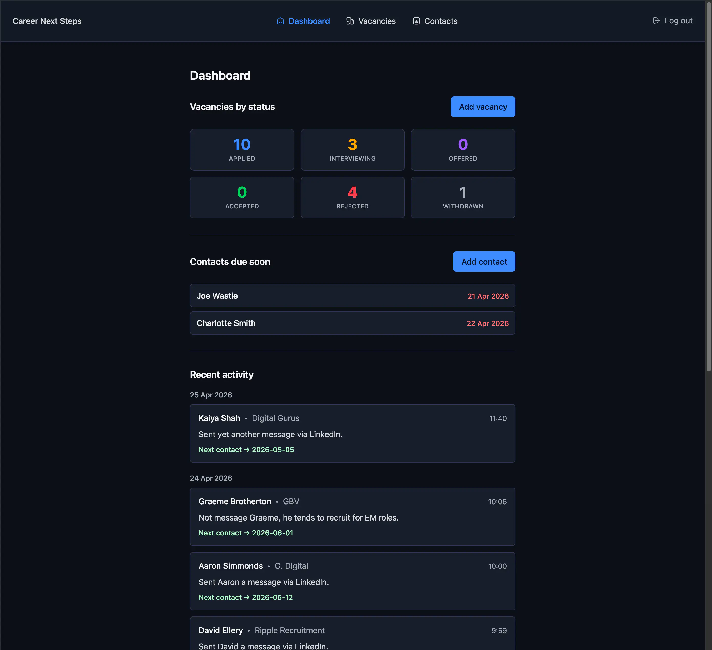
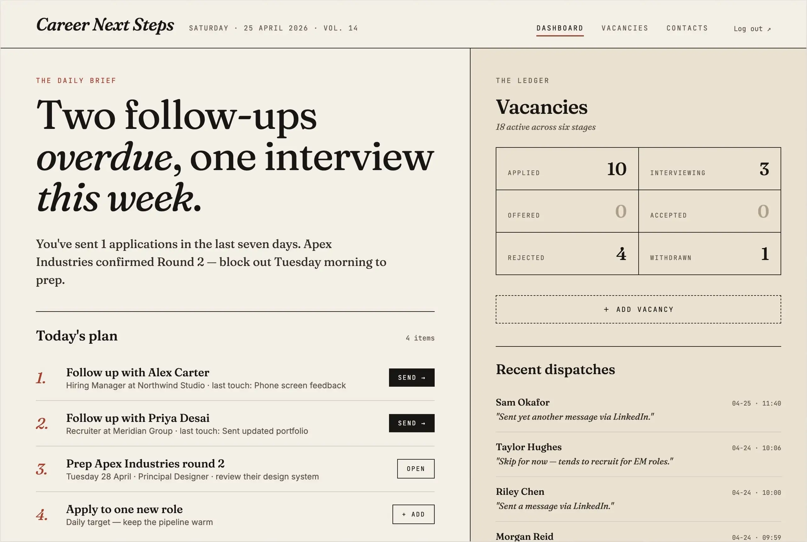
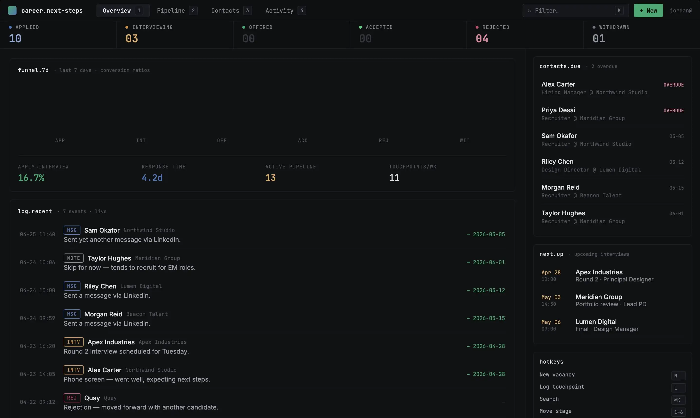
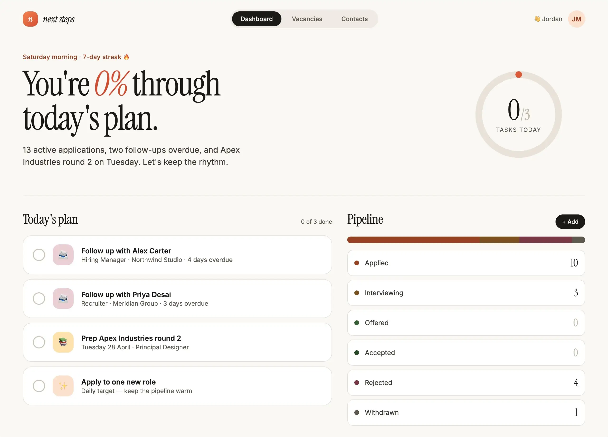

I've been using Claude Code for a few weeks to learn more about using AI with my development process. After [experimenting with Google Stitch](/blog/google-stitch-experiment), and then hearing about Claude Design I decided to do a similar experiment with it.

## Baseline Web App

To help with my job search, and to learn more about React/Next.js I've created a [job vacancy tracker](https://github.com/neilmerton/career-next-steps) (it also allows the user to keep tabs on any recruiters they're in contact with). It's a fairly simple web app.



I thought this would be a good candidate to see what Claude Design would propose, and if it threw out anything of interest I could easily adapt my web app with the improvements, if any. It would also be a good comparison for me to understand the differences between Google Stitch and Claude Design.

## Prompt

The prompt I gave it was very generic.

```
Propose 3 different designs for this existing web app
```

It was accompanied by the above screenshot. I gave it no context as to the purpose of the web app.

After about a few minutes minute of thinking it came back with the following options.

## Response

Below are the three options it proposed.

### Version v1 - Editorial Daybook

> Light paper aesthetic, serif headlines, focuses on "today's plan".



#### Likes
- I like to focus on today's plan, and the week's summary.
- Newspaper look and feel is cute.

#### Dislikes
- Not overly keen on the colours it chose.
- I don't feel the monospace fonts used in header, main nav elements and vacancies summary area are in keeping with the newspaper aesthetic.

### Version v2 - Pipeline Command

> Dense, kanban-forward, terminal-flavored.



#### Likes
- The stats are a nice touch.
- Proposed use of hotkeys is also a good idea.

#### Dislikes
- I'm certain there's many of the text colours that will not pass accessibility checks.
- Mixing san-serif and monospace fonts together on the same lines (log.recent header line) doesn't look right.
- The top header feels vertically cramped, increasing the white (or should I say black) space will allow it a bit more breathing space.

### Version v3 - Momentum

> Warm, encouraging, progress-focused.



#### Likes
- Again, I quite like the weekly summary (in conversational text form).
- Introducing gamification through a daily streak is also a neat idea.
- "Today's plan" is another great suggestion.

#### Dislikes
- Having the "0%" in italics doesn't look the best.
- In "Today's plan" the number of list items and the total count of items (0 of 3 done) aren't equal, it should say "0 of 4 done".
- The pipeline colours don't stand out enough, it's difficult to easily distinguish between the various statuses in the progress bar.

## Comparison with Google Stitch

Claude Design is lightyears ahead of Google Stitch, and it's only recently been release (mid April 2026). It doesn't produce static images (like Google Stitch), it produces actual web pages. This means I was able to instruct it to anonymise the contact and company names after it did the initial designs. I doubt you'd be able to achieve the same with Google Stitch. I could have spent additional time tweaking the designs through prompts, or selecting 'Edit' and tweak individual element designs.

It also didn't simply produce new designs based on the screenshot provided. It seemed to "understand" the purpose of the screenshot, and propose useful improvements over what's already been created. For example, in the first option "You've sent 1 applications in the last seven days. Apex Industries confirmed Round 2 — block out Tuesday morning to prep." - the original design has nothing like this. It also create pages for the navigation items it found in the design (Dashboard, Vacancies, Contacts), which I didn't ask it to do, and I didn't provide any additional context as to what is contained on those pages, let along provide any context upfront. It did an amazing job at interpreting the image, informing it's own context and then producing output.

## Conclusion

I've been left really impressed by Claude Design. It's doesn't come across as a gimmick tool; it's a tool that you can actually use, and iterate and expand on the ideas it produces. I can imagine that you'd be able to do a lot more with it, like give it a mock up (or choose one of the designs it created) and ask it to create a design system from it. I feel I've only touched the surface of the capabilities on offer, and I'll be spending more time with it in the future.