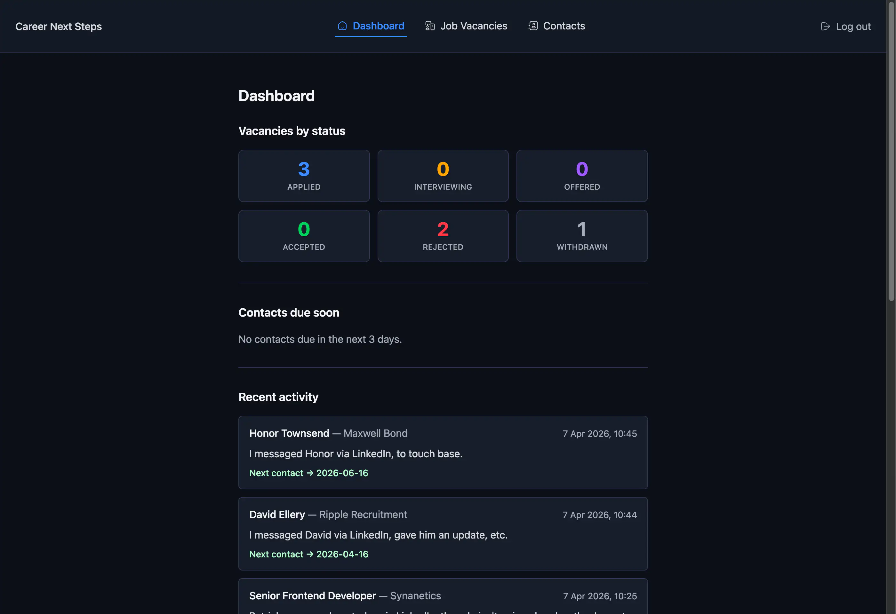
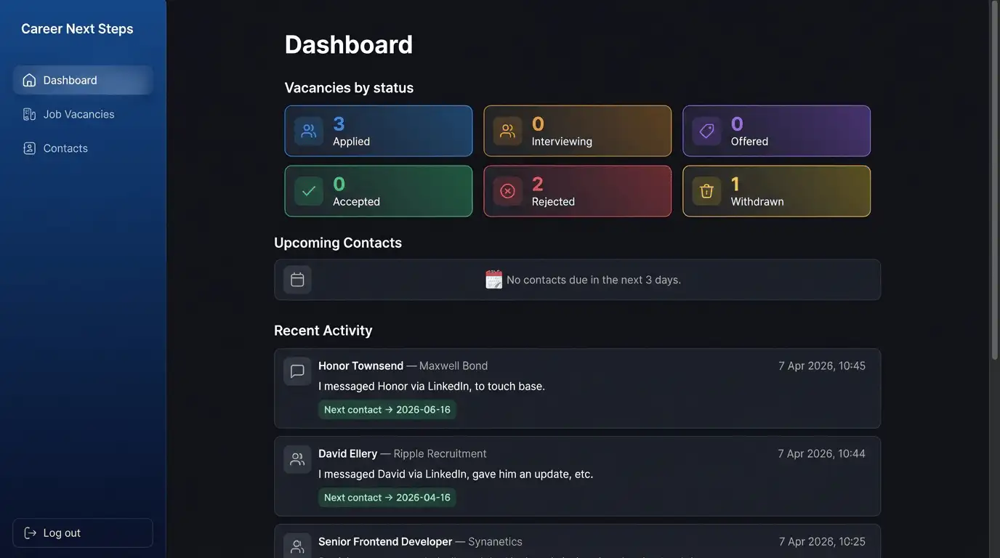
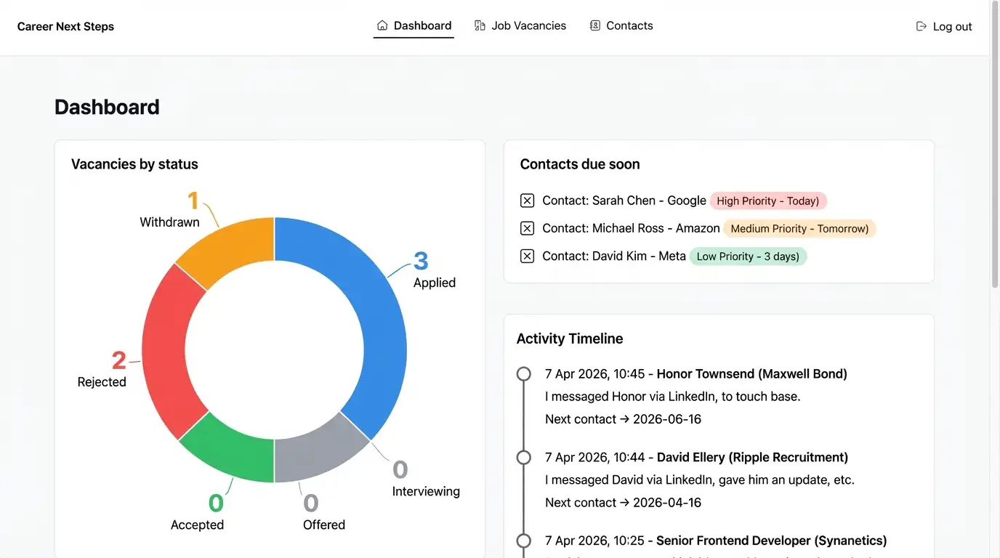
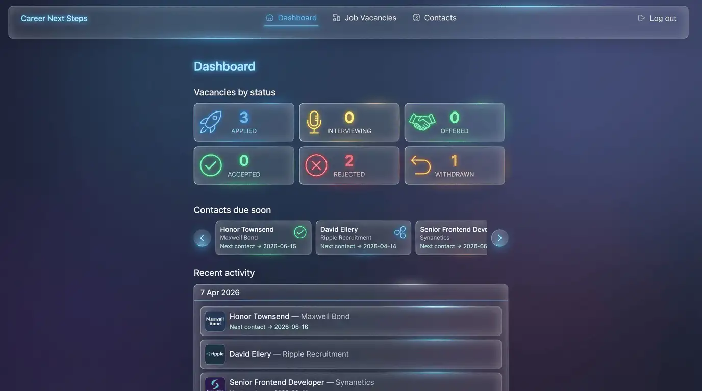

I noticed this morning (on Mastodon) a [post about Google's Stitch AI design tool](https://webdesignerdepot.com/google-stitch-is-this-the-end-of-the-junior-designer/). So I thought I'd have a little play with it.

## Baseline Web App

To help with my job search, and to learn more about React/Next.js I've created a [job vacancy tracker](https://github.com/neilmerton/career-next-steps) (it also allows the user to keep tabs on any recruiters they're in contact with). It's a fairly simple web app.



I thought this would be a good candidate to see what Stitch would propose, and if it threw out anything of interest I could easily adapt my web app with the improvements, if any.

## Prompt

The prompt I gave it was very generic.

```
Propose a redesign of my job application tracker web app
```

It was accompanied by the above screenshot.

After about a minute of thinking it came back with the following options. In true AI style, there were three of them!

## Response

Below are the three options it proposed.

### Version v1

> A sophisticated dark-mode layout featuring a sidebar navigation, modern card-based stats with vibrant accents, and a clean, organized activity feed.



#### Likes
- At a push, maybe the gradient backgrounds for the "Vacancies by status" cards. Maybe.

#### Dislikes
- Sidebar, no need for it, the web app has very simple navigation.
- Inconsistent widths of the main content sections; "Vacancies by status" is slightly narrower than upcoming contacts and recent activity.
- Additional icons, again no need for it.
- Emoji for upcoming contacts empty state, it's just not consistent with the rest of the iconography it proposed.

### Version v2

> A professional light-themed version with high contrast, featuring a prominent doughnut chart for application tracking and a task-oriented approach to upcoming contacts.



#### Likes
- Using a donut chart for the "Vacancies by status" is a decent proposal.

#### Dislikes
- Using a donut chart for the "Vacancies by status" as it will add additional payload resource to generate it, and isn't worth the data it would require.
- Checkboxes (I think?) in "Contacts due soon" items, is it proposing these become todo items?
- The orphaned `)` in the priority chips, in "Contacts due soon", is bazar! And nowhere is there a status set for contacts. Maybe I could use the `next_contact_date` to compare to the current date to determine the dynamic priority chip? But this isn't required.

### Version v3

> A futuristic "glassmorphism" aesthetic with semi-transparent panels, neon status icons, and a horizontal carousel for tracking urgent contacts.



#### Likes
- Grouping the "Recent activity" items with a date header could make sense, the list will never be more than 10 items, however it *might* reduce repetitive dates being displayed.

#### Dislikes
- The main navigation is hideous. The items aren't aligned centrally.
- Again additional icon suggestions aren't needed.
- The "Contacts due soon" carousel is awful. If there's more than 3 recruiters I need to contact I want to see the data without having to interact with the UI.

## Conclusion

I'm not sold. Sure, it came back with some alternative methods to display content. But the quality is lacking, in a big way. The user experience isn't carefully considered. And even proposing "glassmorphism" is just horrid.