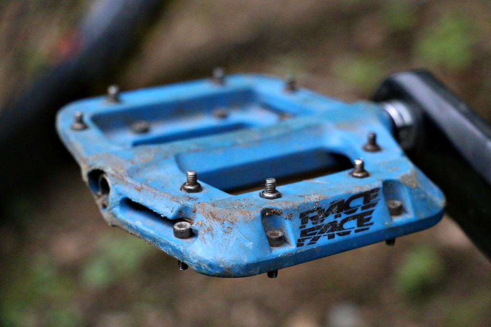
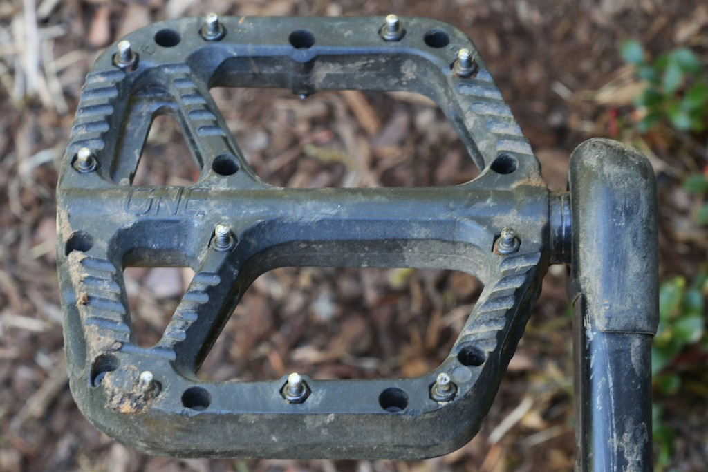
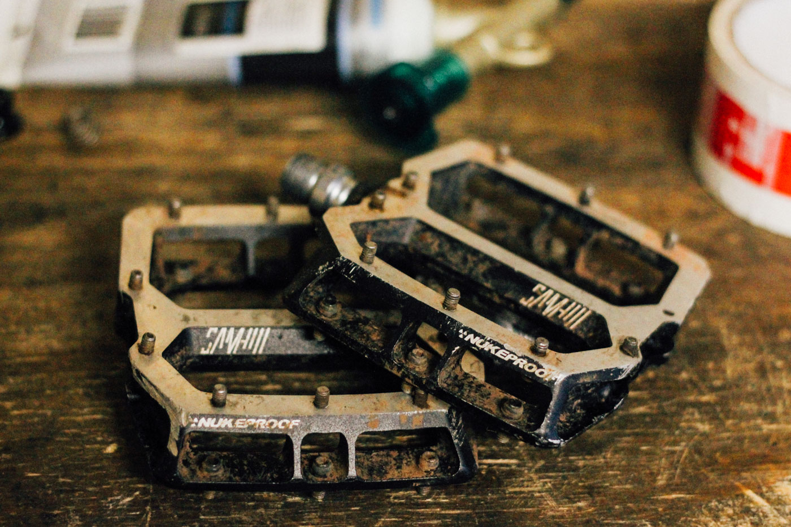
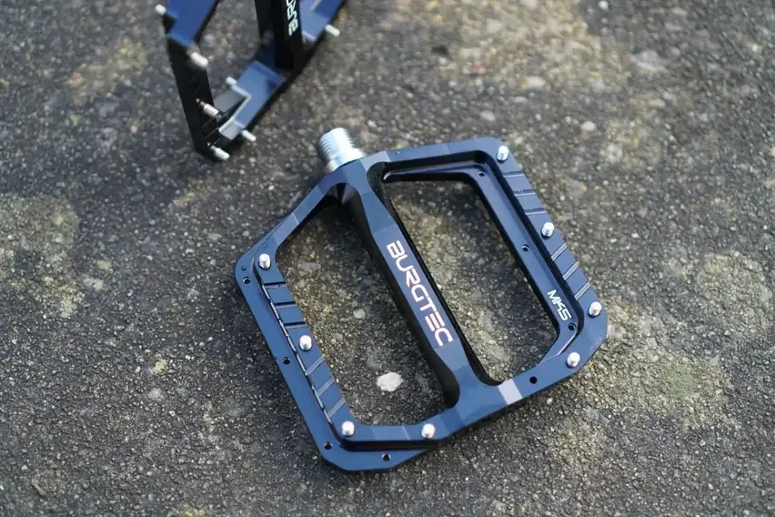
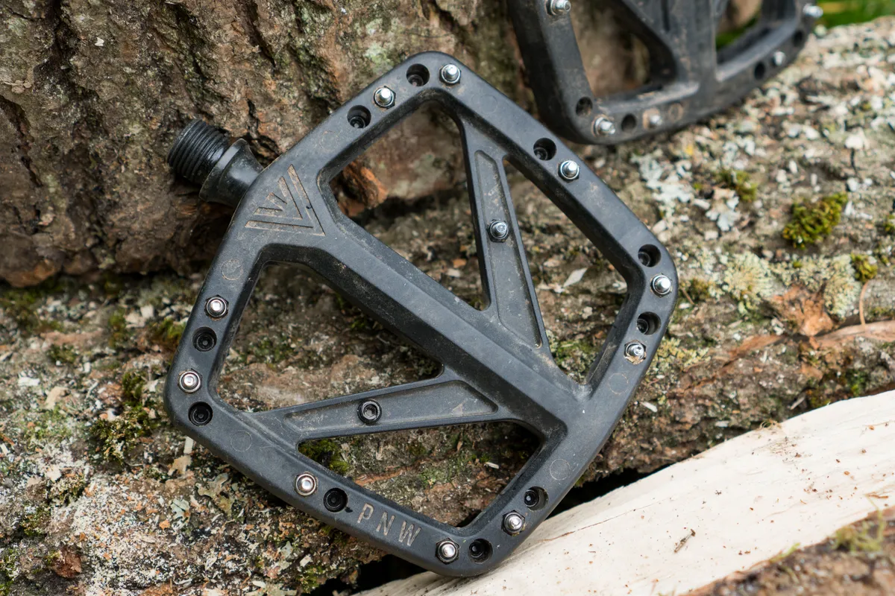
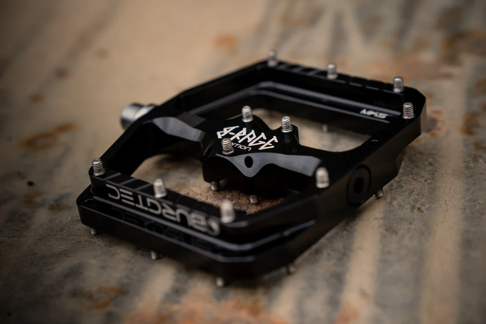

I've been riding mountain bikes since 2018, and I've only ever used flat pedals on my bikes. During this time I've used a few different pedals, I'll give my honest review on these below.

_Note:_ I've worn **Five Ten Freerider**'s for most of my biking experience. I'm on my second pair. This should add some context to the reviews.

## Race Face - Chester Pedal

Number of pins per side: 8

This was my first proper flat pedal set I bought when I started out. They were a cheap introduction to the world of flat pedals. And I soon found out, there's a myriad of them out there!

## OneUp - Composite Pedal

Number of pins per side: 10

After not being overly impressed with the Race Face Chester pedal I did some further research and opted to buy the OneUp composite pedal (in black).

This pedal served me well on my first proper mountain bike. It's low-cost, light-weight, durable and grips the shoe well.

## Nukeproof - Horizon Pro Sam Hill DH Pedal

Number of pins per side: 10

In late 2020 I decided that I needed an enduro mountain bike. Once the appropriate bike was purchased I decided to upgrade the pedals to ensure they matched the new bike's increased capabilities, obviously. So, more research was undertaken.

Compared to the previous pedals these one had some much grip. It'll be down to the pins. However I faced the same problems many others have faced, that is the outer pins all needed replacing within the first few months. The downside to the pedals are the weight - they are heavy.

## Burgtec - Penthouse Mk5 Pedal

Number of pins per side: 8

Roll along 2024 and I decide it's time for a different bike, this time going back to a trail bike (less suspension travel), so again, time for some new pedals. The bike I chose is a Santa Cruz 5010. Santa Cruz Mountain Bikes have generally had a close affiliation with Burgtec, so it seemed an obvious choice to get Burgtec's Penthouse Mk5 pedals.

For me they just don't feel like they grip enough, compared to the Nukeproof pedals. I have a feeling that it's down to pin-placement. The inside of the pedal (closest to where it gets screwed into the crank) doesn't have any pins. I could constantly feel my feet moving about on the pedals, and this negatively impacts on confidence.

## PWN - Range Pedal

Number of pins per side: 11

After not getting on with the Penthouse pedals, not matter how much I wanted to, I was back on the hunt again for my next set of pedals.

I have high-hopes (regardless of the online reviews) for these pedals. They have the most pins in any of the previous pairs of pedals I've owned.

## Burgtec - Penthouse Mk5 B-Rage Edition Pedal

Number of pins per side: 11

I should have listened to the online reviews - those PWN Range pedals didn't live up to my expectations. But thankfully Burgtec released a new version of the Mk5 pedal - the B-Rage edition.

When I saw them I knew they would deliver. Each side has three pins in the centre, of course these are going to be grippy, right?

I've had three rides on them so far, and they seem to be gripping well enough.
